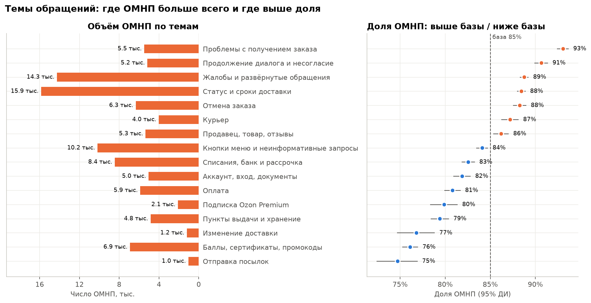
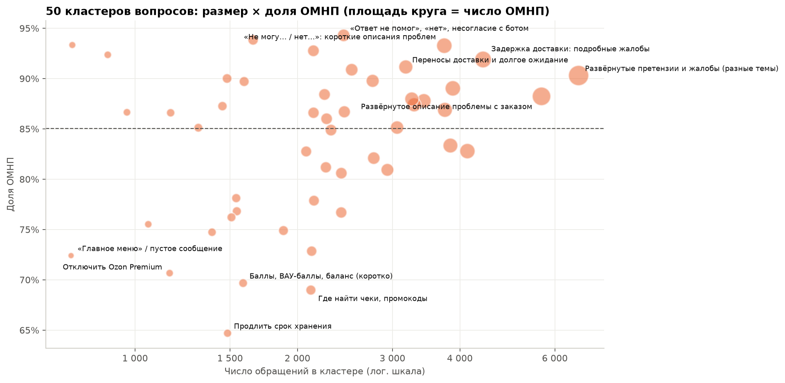
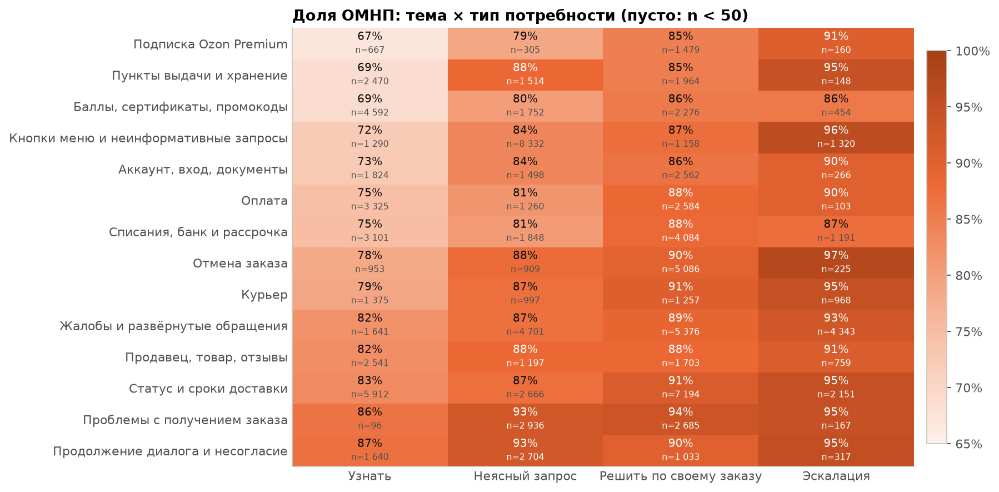
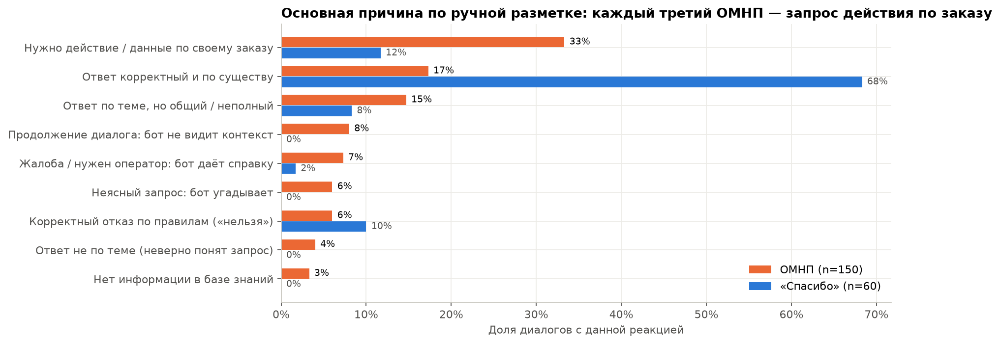
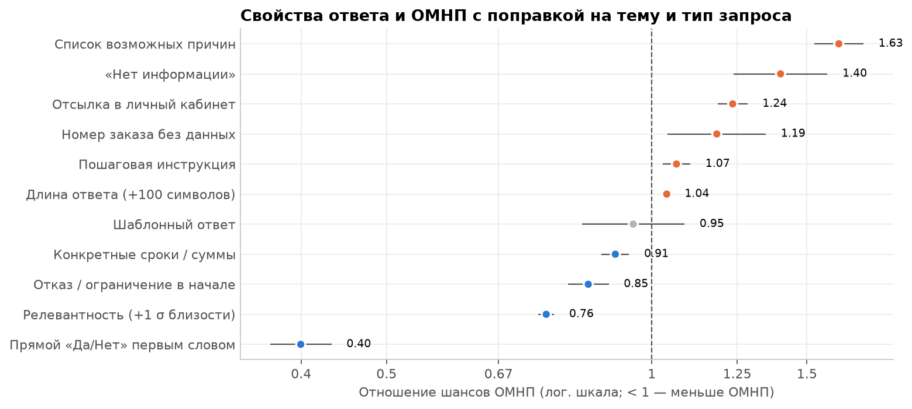
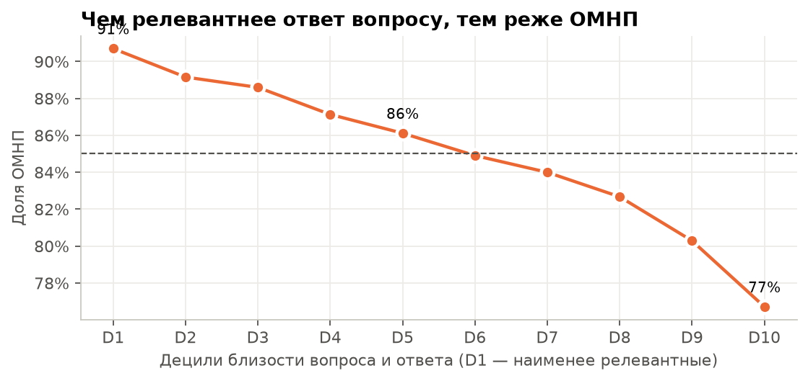
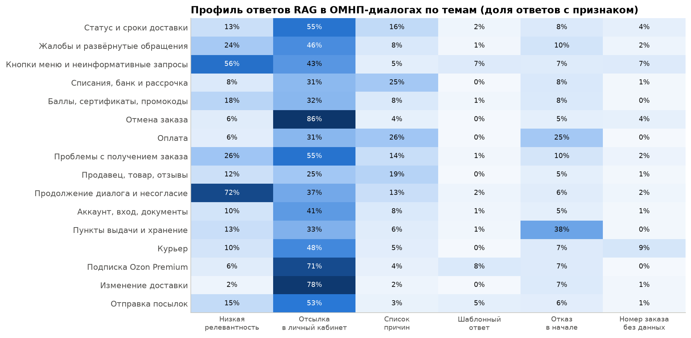
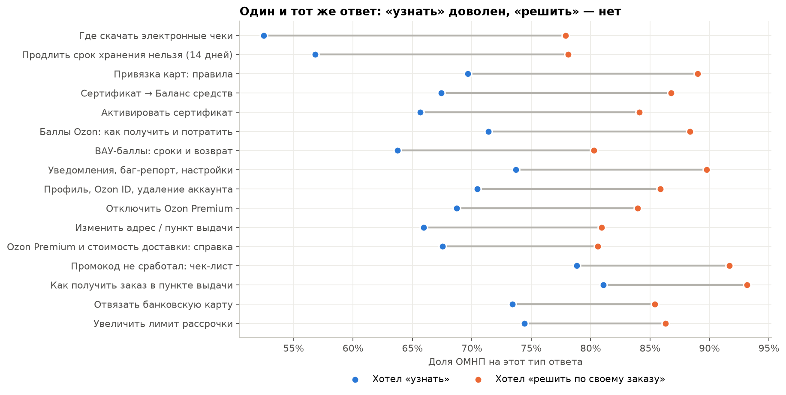
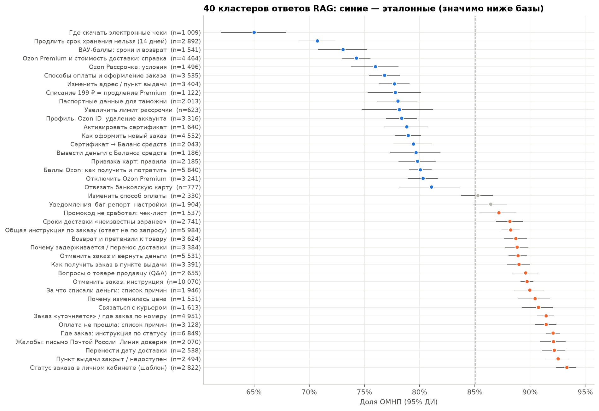
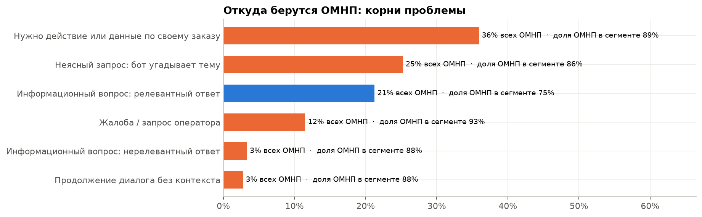

# Почему пользователи нажимают «Ответ мне не помог»

**Исследование качества ответов RAG-чатбота поддержки Ozon**

Данные: 119 992 диалога «вопрос → ответ RAG → кнопка реакции». Код: [`notebooks/omnp_analysis.ipynb`](../notebooks/omnp_analysis.ipynb) (воспроизводимый, запускается в Google Colab). Дашборд: [`dashboard/index.html`](../dashboard/index.html).

---

## Главное

1. **85% нажатий — «Ответ мне не помог» (ОМНП).** Это не доля плохих ответов бота: в выборке только диалоги с нажатой кнопкой. Поэтому сегменты сравниваются относительно базы в 85%.
2. **ОМНП определяется прежде всего тем, что нужно человеку, а не темой.** Информационный вопрос («можно ли…», «как…») получает ОМНП в 76% случаев. Запрос, где нужно что-то сделать по своему заказу, — в 89%. Жалоба или запрос оператора — в 93%. Внутри одной темы разрыв составляет 8–18 п.п.
3. **Главный источник ОМНП: бот отвечает справкой там, где нужно действие.** Около 36% всех ОМНП — запросы по конкретному заказу: «где мой заказ», «отмените», «верните деньги». На них бот выдаёт общую инструкцию «перейдите в раздел Заказы». В ручной разметке это тоже самая частая причина: каждый третий ОМНП (33%, 95% ДИ 26–41%).
4. **Системные проблемы ответов** (с поправкой на тему и тип запроса):
   * «Список возможных причин» вместо ответа: шансы ОМНП ×1,63.
   * «Нет информации в базе знаний»: ×1,40.
   * Отсылка в личный кабинет: ×1,24.
   * Номер заказа в ответе без данных по нему: ×1,19.
   * Нерелевантный ответ: в нижнем дециле близости вопроса и ответа ОМНП 91% против 77% в верхнем.
5. **Прямой ответ первым словом работает лучше всего.** «Да, можно…» или «Нет, нельзя…» снижает шансы ОМНП в 2,5 раза (OR 0,40). Даже корректный отказ («продлить хранение нельзя, срок 14 дней») — один из самых «благодарных» ответов.
6. **Реакции расходятся с ожиданиями в трёх местах:**
   * На **один и тот же ответ** человек, которому нужно было «решить по своему заказу», жмёт ОМНП в среднем на 11 п.п. чаще, чем тот, кто хотел «узнать». Так в 98% кластеров ответов.
   * Кнопки работают **как навигация**: «человек» → 99% ОМНП (путь к оператору), «назад» и «главное меню» → 41–48% (кнопкой «Спасибо» выходят из диалога).
   * По ручной разметке 23% ОМНП стоят на корректном ответе, а 22% «Спасибо» — на ответе, который задачу не решил.
7. **Эталоны.** 18 из 40 кластеров ответов значимо лучше базы. Их общие черты: прямой ответ в первой фразе, одна конкретика (срок, сумма, раздел), короткий текст, вопрос «узнать».

**Пять рекомендаций** (подробно в разделе 8):
1. Дать боту действия и данные по заказу (статус, отмена, перенос, возврат) через инструменты.
2. Сразу маршрутизировать жалобы и запросы оператора.
3. Задавать уточняющий вопрос вместо того, чтобы угадывать по 1–3 словам.
4. Ввести стандарт ответа «сначала прямой ответ», запретить «списки причин».
5. Разделить кнопки оценки и навигации и собирать причину ОМНП.

---

## 1. Задача и данные

**Цель.** Понять, что происходит в диалогах с ОМНП, найти системные проблемы RAG-ответов и точки роста.

**Данные.** Одна таблица, 119 992 строки, пропусков нет:

| Поле | Содержание |
|---|---|
| `user_message` | вопрос пользователя, медиана 7 слов, 102 тыс. уникальных |
| `rag_answer` | ответ RAG в Markdown, медиана 689 символов, 114 тыс. уникальных |
| `reaction_button` | «Ответ мне не помог» 102 028 (85,0%) / «Спасибо, всё понятно» 17 964 (15,0%) |

**Ограничения, которые влияют на выводы:**
* **Только диалоги с нажатой кнопкой.** Неизвестно, сколько пользователей ушли молча, поэтому абсолютную «долю плохих ответов» оценить нельзя. Сравниваем сегменты между собой.
* **Нет дат, ID сессии и пользователя, найденных фрагментов базы знаний.** Многошаговые диалоги не восстанавливаются, а оценить отдельно ретривер и генерацию нельзя.
* **Одна строка — одна пара «вопрос–ответ».** Реплики вида «вопрос выше» или «я же писал» относятся к предыдущим шагам, которых нет в данных.

**Качество данных** (`outputs/tables/01_data_quality.csv`):

| Наблюдение | Доля | Что это значит |
|---|---|---|
| Вопросы из 1–3 слов | 20,3% | нажатия кнопок меню и темы без вопроса («Рассрочка», «Другой заказ») |
| Вопросы с маской `[УДАЛЕНО]` | 10,8% | в основном номера заказов |
| Ответы с номером заказа или трек-номером | 2,5% | маскирование к ответам не применялось; бот «повторяет» номер, но данных по нему не даёт |
| Ответы с незакрытой ссылкой `(url` | 74,3% | вероятно, артефакт анонимизации ссылок; если так же в продакшне — битая разметка |
| Ответы, обрезанные при выгрузке | ~10% | текст обрывается около 1100 символов; на реакцию не влияет |
| Иероглифы в ответе | 17 шт. | редкий артефакт генерации: китайские иероглифы посреди русского слова |
| Полные дубли пары «вопрос + ответ» | 1,3% | оставлены: это реальные повторы |

## 2. Подход

1. **Эмбеддинги** вопросов и ответов моделью `multilingual-e5-small` (префиксы `query:` / `passage:`). Близость вопроса и ответа служит прокси релевантности.
2. **Кластеризация.** KMeans (k = 50) по вопросам → ручные названия → 16 тем. KMeans (k = 40) по ответам → «статьи» базы знаний.
3. **Правила** (регулярные выражения): тип намерения пользователя и признаки ответа.
4. **Ручная разметка** 210 диалогов: основная причина ОМНП. По ней же проверены правила.
5. **Модель «ожидаемой реакции»** (градиентный бустинг, прогнозы out-of-fold) → неожиданные реакции.
6. **Логистическая регрессия**: свойства ответа → ОМНП с поправкой на тему и тип запроса.

* **Кластеризация.** Число кластеров k = 50 выбрано по силуэту (0,073 против 0,065 при k = 40) и интерпретируемости. Каждый кластер назван вручную по ключевым словам (c-TF-IDF) и примерам, затем кластеры сведены в 16 тем. Центроиды сохранены в `data/`, поэтому при повторном запуске номера кластеров не меняются.
* **Статистика.** Для долей — 95% доверительные интервалы Уилсона. «Избыточные ОМНП» = фактические ОМНП − n × 85%.
* **Ручная разметка.** Случайная выборка: 150 ОМНП и 60 «Спасибо». Каждому диалогу присвоена одна основная причина по 9 категориям (`data/manual_labels.csv`).

## 3. Кластеры вопросов, по которым чаще нажимают ОМНП

**По объёму ОМНП** лидируют:

| Тема | ОМНП | Доля ОМНП |
|---|---|---|
| Статус и сроки доставки | 15,9 тыс. | 88% |
| Жалобы и развёрнутые обращения | 14,3 тыс. | 89% |
| Кнопки меню и неинформативные запросы | 10,2 тыс. | 84% |
| Списания, банк и рассрочка | 8,4 тыс. | 83% |

**По доле ОМНП** хуже всего:

| Тема | Доля ОМНП |
|---|---|
| Проблемы с получением заказа | 93% |
| Продолжение диалога и несогласие с ботом | 91% |
| Жалобы | 89% |
| Статус доставки | 88% |
| Отмена заказа | 88% |
| Курьер | 87% |

**Лучше базы:**

| Тема | Доля ОМНП |
|---|---|
| Отправка посылок | 75% |
| Баллы, сертификаты, промокоды | 76% |
| Изменение доставки | 77% |
| Пункты выдачи и хранение | 79% |
| Подписка Premium | 80% |

**Кластеры с наибольшим «избытком» ОМНП** (`outputs/tables/03_question_clusters.csv`):

| Кластер | Обращений | ОМНП | Избыток ОМНП |
|---|---|---|---|
| Развёрнутые претензии и жалобы | 6 640 | 90,3% | +350 |
| «Не могу… / нет…»: короткие описания проблем | 3 743 | 93,3% | +308 |
| Задержка доставки: подробные жалобы | 4 417 | 91,9% | +303 |
| «Ответ не помог», «нет», несогласие с ботом | 2 436 | 94,3% | +226 |
| Переносы доставки и долгое ожидание | 3 176 | 91,2% | +194 |
| Заказ не доставлен / не меняется статус | 2 141 | 92,8% | +166 |
| «Отменить заказ» (команда) | 3 882 | 89,0% | +155 |
| Курьер: жалобы и проблемы доставки | 2 521 | 90,9% | +147 |
| Где мой заказ | 1 655 | 93,8% | +146 |
| Вход в аккаунт, коды подтверждения | 2 757 | 89,8% | +131 |

**Лучшие кластеры:**

| Кластер | Доля ОМНП |
|---|---|
| Продлить срок хранения | 64,7% |
| Где найти чеки и промокоды | 69,0% |
| Баллы и ВАУ-баллы (коротко) | 69,7% |
| Отключить Ozon Premium | 70,7% |
| Способы оплаты и постоплата | 72,8% |

Кластеры получились двух типов: **тематические** и **по форме запроса** (длинные жалобы, однословные кнопки, реплики вроде «вопрос выше»). Второй тип важен: форма запроса сама по себе связана с ОМНП. Чем длиннее обращение, тем выше доля ОМНП: 83–84% у запросов из 4–10 слов, 89% у 21–50 слов и 94% у запросов длиннее 50 слов (`01_omnp_by_length.png`).

### Тип потребности важнее темы

Правилами определяем, что хочет человек:

| Потребность | Тип запроса | Доля обращений | Доля ОМНП |
|---|---|---|---|
| **Узнать** | информационный вопрос | 27% | **76%** |
| **Неясный запрос** | прочее утверждение | 17% | 86% |
| | кнопка или тема без вопроса | 9% | 85% |
| | продолжение диалога | 3% | 89% |
| **Решить по своему заказу** | проблема | 15% | 91% |
| | просьба о действии | 12% | 85% |
| | статус заказа | 7% | 92% |
| **Эскалация** | жалоба или эмоции | 9% | 93% |
| | запрос оператора | 1% | **96%** |

**Внутри каждой темы** «узнать» получает ОМНП заметно реже, чем «решить по своему заказу»:

| Тема | «Узнать» | «Решить по заказу» |
|---|---|---|
| Premium | 67% | 85% |
| Пункты выдачи | 69% | 85% |
| Баллы | 69% | 86% |
| Оплата | 75% | 88% |
| Отмена | 78% | 90% |
| Статус | 83% | 91% |

Проблема не в теме как таковой, а в несоответствии **типа ответа** (справка) **типу запроса** (действие или персональные данные).

## 4. Что отвечает RAG: системные проблемы

### 4.1 Ручная разметка: основная причина

| Основная причина (ОМНП, n = 150) | Доля | 95% ДИ | Пример (пересказ) |
|---|---|---|---|
| Нужно действие или данные по своему заказу | **33%** | 26–41% | «Заказ № … когда приедет???» → «Статус отображается в разделе Заказы» |
| Ответ корректный и по существу | 17% | 12–24% | вопрос о сроке начисления баллов → точный срок |
| Ответ по теме, но общий или неполный | 15% | 10–21% | «Почему списали 299 ₽?» → список из пяти общих причин |
| Продолжение диалога: бот не видит контекст | 8% | 5–13% | «Вы не ответили на мой вопрос» → инструкция про вопросы о товаре |
| Жалоба или нужен оператор: бот даёт справку | 7% | 4–13% | «Хочу оставить жалобу» → адрес для письма Почтой России |
| Корректный отказ по правилам | 6% | 3–11% | «Не хочу давать паспортные данные» → «они обязательны для таможни» |
| Неясный запрос: бот угадывает | 6% | 3–11% | «Другой заказ» → «Как оформить новый заказ» |
| Ответ не по теме | 4% | 2–8% | «Где информация по открытому спору?» → инструкция по отмене заказа |
| Нет информации в базе знаний | 3% | 1–8% | вопрос про безопасность конкретного товара |

Среди «Спасибо» (n = 60) 68% — корректные ответы по существу, 10% — корректные отказы.

**Как правила согласуются с разметкой:** 68% диалогов с меткой «нужно действие» правила относят к «решить по заказу» или «эскалации». Правила консервативны: часть таких запросов уходит в «неясные утверждения», поэтому оценки масштаба ниже скорее занижены.

### 4.2 Признаки ответа в масштабе всего датасета

| Признак ответа | Доля ответов | ОМНП, если есть | ОМНП, если нет | OR с поправкой* |
|---|---|---|---|---|
| Прямой «Да» или «Нет» первым словом | 2,4% | **56,5%** | 85,7% | **0,40** (0,37–0,43) |
| Отказ или ограничение в начале ответа | 10,5% | 80,6% | 85,6% | 0,85 (0,80–0,89) |
| Конкретные сроки, суммы, проценты | 44,6% | 85,1% | 84,9% | 0,91 (0,88–0,94) |
| Релевантность (+1σ близости вопрос–ответ) | — | — | — | 0,76 (0,74–0,78) |
| Пошаговая инструкция «сделайте сами» | 53,7% | 85,9% | 84,0% | 1,07 (1,03–1,11) |
| Номер заказа в ответе без данных по нему | 2,5% | 90,6% | 84,9% | 1,19 (1,04–1,35) |
| Отсылка в личный кабинет в начале ответа | 44,5% | 87,1% | 83,4% | 1,24 (1,19–1,28) |
| «Нет информации в базе знаний» | 2,0% | 86,8% | 85,0% | 1,40 (1,24–1,58) |
| **Список возможных причин вместо ответа** | 11,2% | 90,3% | 84,4% | **1,63** (1,53–1,74) |

\* Отношение шансов ОМНП из логистической регрессии с фиксированными эффектами темы и типа запроса. Это корреляция, а не причинный эффект; проверять нужно A/B-тестом.

**Релевантность.** Ответы из нижнего дециля близости вопроса и ответа получают 90,7% ОМНП, из верхнего — 76,7%. Зависимость монотонная.

### 4.3 Профиль проблем по темам

* **Отмена заказа, изменение доставки, Premium.** Отсылка в личный кабинет стоит в 71–86% ОМНП-ответов. Пользователь просит «отмените», бот отвечает «нажмите кнопку Отменить». Сам же ответ при этом предупреждает, что кнопка бывает недоступна.
* **Оплата и списания.** Четверть ОМНП-ответов построена как «список возможных причин»: «оплата может не пройти по следующим причинам…». Человеку нужна причина в его случае.
* **Пункты выдачи и хранение.** 38% ответов — отказ («продлить хранение нельзя»). Это корректно и в среднем воспринимается лучше прочих ответов, но в каждом ОМНП-случае человек ждал решения.
* **Кнопки меню и продолжения диалога.** У 56% и 72% ответов низкая релевантность: бот угадывает тему по 1–2 словам или по реплике без контекста. Примеры: «Человек» → ответ про неудачную оплату; «Другой заказ» → инструкция, как оформить новый заказ.

### 4.4 Типовые ошибки ответов
1. **Справка вместо действия**: самая массовая ошибка.
2. **Неверная интерпретация коротких запросов.** «Другой заказ», «Человек», «Назад», «Оформить доставку» стабильно попадают в неподходящие статьи.
3. **Потеря контекста**: «вопрос выше», «вы не ответили», «я же писал».
4. **Формальный ответ на эмоциональное обращение.** «Хочу оставить жалобу» → почтовый адрес для претензии. «Сотрудник ПВЗ выдал заказ, а я его не получил» → «риск переходит к получателю с момента передачи». В 27 ответах из 120 тыс. есть слова сожаления или эмпатии.
5. **Ответ «по шаблону статуса»**: один и тот же текст «Статус заказа отображается в разделе Заказы…» встречается сотни раз и получает 92–98% ОМНП.
6. **Гигиена**: повтор номера заказа без данных, иероглифы, незакрытые ссылки.

## 5. ОМНП и «Спасибо»: где реакция расходится с ожидаемой

### 5.1 Один и тот же ответ — разные реакции

Для каждого кластера ответов (по сути, статьи базы знаний) сравнили долю ОМНП у тех, кто хотел «узнать», и у тех, кто хотел «решить по своему заказу». **Разрыв положительный в 98% кластеров, в среднем 10,7 п.п.** Примеры:

| Статья | «Узнать» | «Решить» |
|---|---|---|
| Где скачать электронные чеки | 52% | 78% |
| Продлить хранение нельзя | 57% | 78% |
| Привязка карт | 70% | 89% |

Содержание ответа одинаковое, а реакция определяется ожиданием пользователя.

### 5.2 Кнопки как навигация, а не оценка

| Сообщение пользователя | n | Доля ОМНП |
|---|---|---|
| «оператор» | 42 | **100%** |
| «человек» | 307 | **99,3%** |
| «ответ мне не помог» (набран текстом) | 83 | 96,4% |
| «нет» | 86 | 95,3% |
| «другое» | 70 | 91,4% |
| «другой заказ» | 615 | 86,8% |
| «главное меню» | 289 | **48,1%** |
| «назад» | 90 | **41,1%** |

ОМНП, по-видимому, служит **дорогой к оператору**, а «Спасибо» — **способом выйти** из ветки. Часть «Спасибо» на навигационных репликах — не оценка ответа. Это искажает обе метрики.

### 5.3 Неожиданные реакции по модели

Модель «ожидаемой реакции» (ROC-AUC = 0,726 out-of-fold, хорошо откалибрована) находит два вида расхождений:

* **Неожиданный ОМНП** — модель ждёт «Спасибо», p < 0,5; таких 837 случаев.
  * 82% из них — информационные вопросы.
  * 30% ответов начинаются с «Да» или «Нет» (против 1,6% среди всех ОМНП), 26% — с отказа (против 10%).
  * Это **верные, но нежеланные ответы**: «продлить хранение нельзя», «примерять купальники в ПВЗ нельзя».
  * Чаще всего в темах «отправка посылок» (6,5% диалогов темы), «баллы» и «пункты выдачи» (по 2,7%).
  * Точка роста — не ретривер, а **альтернатива в ответе**: что можно сделать вместо запрещённого.
* **Неожиданное «Спасибо»** — модель уверена в ОМНП, p ≥ 0,95; таких 406 случаев.
  * Сосредоточены в «проблемах с получением» (1,3% темы), «продолжении диалога» и «статусе».
  * Часть — вежливость или закрытие диалога (в 660 вопросах человек сам пишет «спасибо»).
  * Часть — ответы, отсылающие в чат поддержки: человек получил «выход к человеку» и поблагодарил.

### 5.4 По ручной разметке
* **23% ОМНП** (95% ДИ 17–31%) поставлены на корректный ответ или корректный отказ.
* **22% «Спасибо»** (13–34%) поставлены на ответ, который задачу не решил: справка на запрос действия, общий ответ.

**Вывод.** Кнопки — шумный индикатор качества. ОМНП примерно на четверть состоит из «правильный ответ, но не то, что я хотел или нужен человек», а «Спасибо» часто означает выход из диалога.

## 6. Хорошие кластеры ответов — эталоны

18 из 40 кластеров ответов значимо лучше базы: верхняя граница 95% ДИ ниже 82%. Лучшие:

| Кластер ответа | n | Доля ОМНП | Почему работает |
|---|---|---|---|
| Где скачать электронные чеки | 1 009 | 65,0% | одно место и одно действие, два предложения |
| Продлить хранение нельзя (14 дней) | 2 892 | 70,7% | прямой ответ первым словом, конкретный срок, альтернатива |
| ВАУ-баллы: сроки и возврат | 1 541 | 73,1% | точные сроки («в течение двух дней», «90 дней») |
| Ozon Premium: справка | 4 464 | 74,3% | определение и ключевые условия с числами |
| Ozon Рассрочка: условия | 1 496 | 76,0% | условия списком с числами (лимит, без первого взноса) |
| Способы оплаты | 3 535 | 76,8% | перечень вариантов без «если…» |
| Изменить адрес или пункт выдачи | 3 404 | 77,7% | «Да, можно, если…» + 3 шага |
| Списание 199 ₽ = продление Premium | 1 122 | 77,8% | **гипотеза о конкретной причине** вместо списка причин |

**Худшие** (93–91% ОМНП): «Статус заказа в личном кабинете» (шаблон), «Пункт выдачи закрыт», «Перенести дату доставки», «Жалобы: письмо Почтой России», «Где заказ: инструкция», «Оплата не прошла: список причин», «Связаться с курьером».

**Принципы эталонного ответа** (выведены из лучших кластеров и регрессии):
1. **Первое предложение отвечает на вопрос**: «Да» / «Нет» / срок / сумма / место.
2. **Одна конкретная причина или условие**, а не перечень «может быть связано с…». На вопросы, где упомянута сумма 199 ₽, ответ «Списание 199 ₽ — это продление Premium» получает 76,5% ОМНП, а «Списание может происходить по следующим причинам…» — 88,6%.
3. **Если нельзя — сразу альтернатива**: что можно сделать вместо этого.
4. **Короче**: каждые +100 символов дают OR 1,04.
5. **Инструкция только там, где пользователь действительно может сделать сам**: «отключить Premium» (70,7% ОМНП в кластере вопросов) — да; «отменить заказ, который уже нельзя отменить» — нет.

Примеры эталонных формулировок лежат в `outputs/tables/07_etalon_answers.csv`. Например, «Отключить Ozon Premium»: 13 показов, 31% ОМНП.

## 7. Масштаб: откуда берутся ОМНП

Взаимоисключающие сегменты по правилам:

| Корень проблемы | Доля всех ОМНП | Доля ОМНП в сегменте | Доля трафика |
|---|---|---|---|
| Нужно действие или данные по своему заказу | **36%** | 89% | 34% |
| Неясный запрос: бот угадывает тему | 25% | 86% | 25% |
| Информационный вопрос, релевантный ответ | 21% | 75% | 24% |
| Жалоба или запрос оператора | 12% | 93% | 11% |
| Информационный вопрос, нерелевантный ответ | 3% | 88% | 3% |
| Продолжение диалога без контекста | 3% | 88% | 3% |

Около **половины ОМНП** (36% + 12%) RAG по своей архитектуре не может закрыть: нужны данные заказа, действие или человек. Ещё четверть — неясные запросы, где нужен уточняющий вопрос, а не ответ. Лишь меньшая часть ОМНП приходится на «чистое» качество генерации в информационных вопросах.

## 8. Гипотезы и рекомендации

| # | Гипотеза | На чём основана | Что сделать | Метрика и проверка |
|---|---|---|---|---|
| 1 | **Запросы «решить по заказу» нельзя закрыть справкой** | 36% ОМНП; 89% в сегменте; 33% по ручной разметке; разрыв +11 п.п. на одинаковых ответах | Классификатор намерения до RAG. Для статуса, отмены, переноса, возврата денег — вызов инструментов (API заказов) и ответ с данными: «Заказ № … в пути, приедет 24.09». Если действие невозможно, сразу сказать почему и предложить, что можно | ОМНП в сегменте, доля обращений к оператору, повторные обращения; A/B на «где мой заказ» и «отменить заказ» (~9% трафика) |
| 2 | **Жалобы и запросы оператора требуют эскалации, а не справки** | 93–99% ОМНП; «человек» → 99%; ответы на жалобы — почтовый адрес для претензии | Детектор эмоций и запроса оператора → передача человеку с кратким саммари. До передачи — короткий эмпатичный ответ без юридических формулировок | Время до оператора, CSAT после эскалации, ОМНП |
| 3 | **Короткие запросы надо уточнять, а не угадывать** | 20% вопросов из 1–3 слов; кластеры кнопок с низкой релевантностью (56%); «Другой заказ» → «как оформить новый заказ» | Если запрос короче N слов или уверенность ретривера ниже порога — 2–4 кнопки уточнения («Где заказ? / Отменить? / Вернуть деньги?»). Обязательно передавать контекст выбранного заказа из меню | ОМНП и релевантность в кластерах кнопок, доля «продолжений диалога» |
| 4 | **Бот теряет контекст диалога** | кластер «ответ не помог / нет / вопрос выше» — 94% ОМНП; 8% ОМНП по разметке | Передавать историю диалога в переформулировку запроса и в генерацию. После ОМНП не повторять ту же статью | ОМНП на второй реплике, доля повторов статьи |
| 5 | **Формат ответа: сначала прямой ответ, без «списков причин»** | OR 0,40 у «Да/Нет», 1,63 у «списка причин», 1,24 у отсылки в ЛК | Правила в системном промпте и пост-проверка: первая фраза — ответ; не больше одной гипотезы о причине; при отказе — альтернатива; лимит длины | ОМНП в информационных вопросах; A/B промпта |
| 6 | **Ретривер ошибается на коротких и нестандартных запросах** | монотонная связь релевантности с ОМНП (91% → 77%) | Реранкер (cross-encoder), порог уверенности → уточнение вместо ответа; дообучение на парах «вопрос → статья с высоким Спасибо» (эталоны из раздела 6) | Recall@k на размеченной выборке, ОМНП в нижних децилях |
| 7 | **Кнопки обратной связи смешаны с навигацией** | «человек» 99% ОМНП, «назад» 41%, «главное меню» 48%; 23% ОМНП на корректный ответ | Отдельные кнопки «Позвать оператора», «Главное меню». После ОМНП спрашивать причину: «не тот ответ / нужно действие / нужен человек / не согласен с правилом» | Чистота метрики: доля ОМНП с указанной причиной |
| 8 | **Гигиена базы знаний и генерации** | 2% «нет информации»; 2,5% повторов номера заказа; иероглифы; 74% незакрытых ссылок в выгрузке | Пополнить базу (вопросы о товаре, ПВЗ на карте, споры); фильтр ответов с номером без данных; проверка Markdown и языка на выходе | Доля ответов с дефектами → 0 |

**Как приоритизировать.** Самый быстрый эффект дадут гипотезы 3, 5 и 7: они не требуют интеграций и меняются в промпте и интерфейсе. Самый большой — гипотезы 1 и 2: они закрывают около половины ОМНП, но требуют доступа к API заказов и маршрутизации.

**Оценка эффекта на ОМНП.** Это сценарий, а не прогноз. Если довести долю ОМНП в сегменте «решить по заказу» с 89% до уровня информационных вопросов с релевантным ответом (75%), исчезнет около 5,9 тыс. ОМНП на 120 тыс. диалогов, то есть 5,8% всех ОМНП. Если сделать то же с неясными запросами (86% → 75%), исчезнет ещё около 3,3 тыс. (3,3%) Реальный эффект нужно измерять A/B-тестом. Важнее, что ОМНП сменится результативным действием или своевременной эскалацией.

## 9. Ограничения и следующие шаги

**Ограничения:**
* Выборка смещена: в ней только диалоги с нажатой кнопкой.
* Нет контекста диалога и найденных фрагментов базы знаний.
* Тип намерения определяется правилами. Они проверены на 210 размеченных диалогах и консервативны.
* Разметку делал один аналитик, без оценки согласия разметчиков.
* Эффекты свойств ответа — корреляции с поправкой на тему и тип запроса, а не причинные эффекты.

**Что сделать дальше:**
1. Расширить разметку до 1–2 тыс. диалогов с двумя разметчиками. Использовать её для валидации LLM-as-judge по той же таксономии и для постоянного мониторинга.
2. Получить логи ретривера: найденные фрагменты и их скоры. Тогда можно разделить ошибки поиска и генерации.
3. Запустить A/B-тесты для гипотез 5 и 3 как самых дешёвых, затем пилот инструментов по заказу (гипотеза 1) на «где мой заказ» и «отменить заказ».

---

## Приложение: воспроизводимость

| Файл | Что внутри |
|---|---|
| `notebooks/omnp_analysis.ipynb` | весь анализ; Colab: `Runtime → Run all`, загрузить `Датасет для ВШЭ.xlsx` |
| `data/question_centroids.npy`, `data/question_clusters.csv` | центроиды и названия 50 кластеров вопросов |
| `data/answer_centroids.npy`, `data/answer_clusters.csv` | центроиды и названия 40 кластеров ответов |
| `data/manual_labels.csv` | ручная разметка 210 диалогов (id, реакция, метка) |
| `outputs/tables/*.csv`, `outputs/tables/key_facts.json` | все таблицы и цифры из отчёта |
| `outputs/figures/*.png` | графики |
| `dashboard/index.html` | интерактивный дашборд (Plotly) |

Модель эмбеддингов: `intfloat/multilingual-e5-small`. `SEED = 42`. Время полного прогона: около 8 минут на Apple M5, около 5 минут на Colab T4 плюс загрузка данных.
